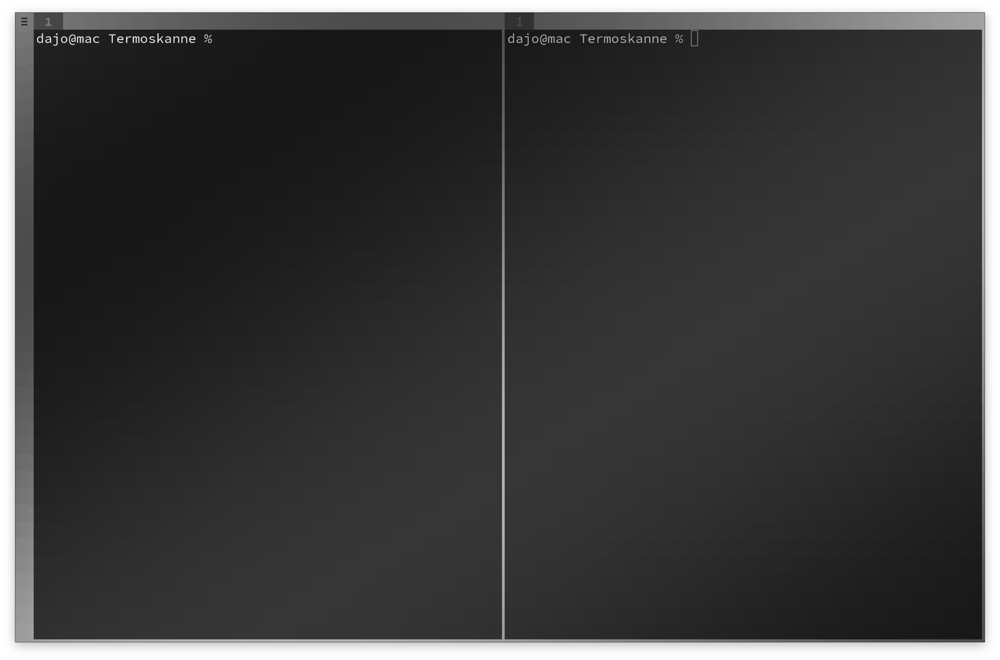

<p align="center">
 
</p>

# Termoskanne

Terminal Emulator written in C



&#x2705; Noiseless and uniform UI  
&#x2705; Versatile tabbing and tiling  

## README Content

 - [Status](#Status)
 - [Dependencies](#Dependencies)
 - [Build](#Build)
 - [Design](#Design)
 - [Architecture](#Architecture)
 - [Development](#Development)

## Status

| OS | Graphics Driver | Status |
| --- | --- | --- |
| Linux*  | OpenGL  | &#x2705; |
| Linux*  | Vulkan  | &#x274C; |
| MacOS   | OpenGL  | &#x274C; |
| MacOS   | Metal   | &#x274C; |
| Windows | OpenGL  | &#x274C; |
| Windows | Vulkan  | &#x274C; |
| Windows | DirectX | &#x274C; |

\* Linux is currently only supported with X11

## Dependencies

The following dependencies **must be present** on the system. 

 * [Git](https://git-scm.com)  
For submodules.
 * [Make](https://www.gnu.org/software/make)  
For building. 

The following dependencies **are automatically compiled** during the build process.

 * [Netzhaut](https://github.com/dajofrey/netzhaut)  
Termoskanne is companion project to [Netzhaut](https://github.com/dajofrey/netzhaut), from which it requires nh-api, nh-core, nh-encoding, nh-wsi and nh-gfx modules.
 * [st](https://st.suckless.org/)  
For shell functionality, Termoskanne uses parts of [st](https://st.suckless.org/).   

## Build

### Linux

```bash
git clone https://github.com/dajofrey/termoskanne
cd termoskanne && git submodule update --init --recursive    
make -f build/automation/Makefile all
```

## Design

### Noiseless UI
A big failure point when designing a UI is clutter. Sometimes even terminals have too much UI elements which make the experience distracting and annoying.

Termoskanne's graphics focus on mono-space font drawing, which is primarily used in terminals. Even Termoskanne's UI is made using the same technique. This makes everything look proportional and clean, even after scaling. Also, it simplifies development a lot. 
   
### Tabing and Tiling
Termoskanne uses a hybrid approach for tabing and tiling:   
  
The user can tab between windows, and split these windows into tiles. This is quite common. However, each tile can be tabbed and tiled individually.

#### Rules

* Termoskanne consists of multiple Macro-Windows. 
* Macro-Windows can be macro-split into multiple Macro-Tiles.
* Macro-Tiles contain multiple Micro-Windows.  
* Micro-Windows can be micro-split into Micro-Tiles.   
* Micro-Tiles cannot be split or tabbed any further.  
 
#### Example

Each newly opened Macro-Window  
&nbsp; contains one Macro-Tile   
&nbsp; &nbsp; which contains multiple Micro-Windows  
&nbsp; &nbsp; &nbsp; with each containing one Micro-Tile  

#### Note 
The hybrid approach makes it necessary to have seperate controls for macro-tabing/micro-tabing and macro-tiling/micro-tiling.

## Architecture

### Enhanced UI capabilites 
Tiles only have background and foreground colors. The background is one solid color and the foreground is a unicode symbol colored using the foreground color.  

This makes it impossible to draw a tile with 3 colors in it. But sometimes this is needed, for example for complex UI. An overlay character is used to solve this.

### Rendering

1. Backdrop  
Render grid of ACCENT color tiles.
2. Clear (if style == 0)  
Clear inside borders with BACKGROUND color.
3. Dim (if style > 0)  
Render quads for dimming.
4. TTy Background   
Render grid of BACKGROUND color tiles.
5. TTy Foreground  
Render grid of char tiles with FOREGROUND or ACCENT color.
TODO

## Development
If you want to contribute, please run `./scripts/prepare-git.sh` which installs a prepare-commit-msg hook for versioning.
